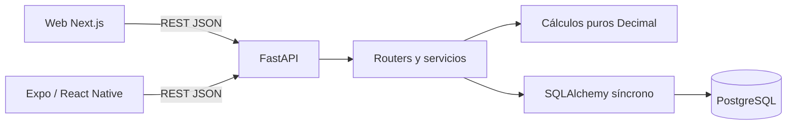

# Auditoría de arquitectura full-stack — Energy RD

Fecha: 4 de octubre de 2026. Repositorio local: `/Users/macbookpro/Desktop/energy-intelligence-rd`. Rama: `Dev`; commit base: `b247f6f`, con cambios locales preexistentes. El análisis corresponde al checkout observado, no certifica ese commit aislado ni un despliegue remoto.

**Diagnóstico:** la base es adecuada para un piloto de cinco viviendas. Conviene conservar el monorepo, una API monolítica modular y PostgreSQL. Las prioridades son control de acceso, consistencia de escrituras, contratos y conexión de los módulos existentes. Una reorganización masiva de carpetas aportaría menos que corregir estos puntos.

## A. Arquitectura actual

### Implementación frente a visión

| Área | Implementado y observado | Documentado o previsto, sin implementación equivalente observada |
|---|---|---|
| Web | Next.js App Router, React 19.2.3, TypeScript, Tailwind, componentes locales, React Query y Zod | README menciona shadcn/ui; no se observó su configuración como sistema instalado |
| Mobile | Expo 57, React Native 0.86.3, TypeScript, React Navigation, React Query, Zustand, AsyncStorage | OCR/cámara e ingestión: dependencias declaradas, sin flujo implementado observado |
| Backend | Python 3.12, FastAPI, Pydantic 2, SQLAlchemy 2 síncrono, psycopg 3, Alembic | Servicios separados de IA, ingestión, workers y motor energético |
| Datos | PostgreSQL 16 local en Compose; cinco tablas del piloto | Neon en producción, TimescaleDB, pgvector, telemetría, solar y baterías |
| API | REST `/api/v1`, validación de entrada y salida, OpenAPI automático | Cliente generado, contratos compartidos, autenticación, autorización |
| Cache | React Query en clientes; pool SQLAlchemy con `pool_pre_ping` | Redis figura en Compose, sin consumo observado en la API |
| Infraestructura | Docker para API y PostgreSQL, migraciones y seed al iniciar; GitHub Actions | Topología productiva, backups verificados, TLS y observabilidad de producción |
| Almacenamiento | PostgreSQL; selección local de vivienda en navegador/dispositivo | Object storage y subida de archivos |

Los manifests declaran rangos de versiones; el build local identifica Next.js **15.5.27**. Python exige `>=3.12,<3.13`, aunque README y documentos antiguos dicen 3.10+. Hay npm workspaces y lockfile raíz, además de un lockfile móvil. No hay paquetes compartidos implementados entre los listados, aunque `packages/*` forma parte de la configuración.

### Cómo funciona

La web permite escoger una vivienda en `/login`; guarda su ID en `localStorage`. El shell protege la navegación visual, pero esa selección **no autentica**. El móvil guarda vivienda y onboarding mediante Zustand/AsyncStorage. Los clientes consultan directamente la API; Next.js no actúa como backend de negocio ni proxy de estas operaciones.

FastAPI expone viviendas, facturas, dashboard, equipos, estimados, alertas y umbrales. Los routers reciben una sesión SQLAlchemy, consultan modelos y hacen commits. Los servicios construyen dashboards y alertas; `calculations.py` contiene cálculos puros con `Decimal`. Cada escritura de factura recalcula alertas en la misma transacción, una decisión correcta para el tamaño actual.



### Carpetas y límites actuales

- `apps/web`, `apps/mobile` y `services/api` separan correctamente plataformas y runtime. Mantenerlos.
- `services/api/app/{api,models,schemas,services}` es comprensible para este volumen. Sus servicios tienen entre 53 y 99 líneas; no hay evidencia de un “god service” que justifique muchas capas nuevas.
- Los routers mezclan HTTP, consultas y transacciones. En facturas también contienen la regla de solapamiento y la coordinación con alertas. Ese es el primer límite que conviene extraer.
- `apps/web/src/lib` mezcla infraestructura, sesión, formato y reglas de formulario. `bill-form.ts` y `components/bill-form.tsx` pertenecen a facturas.
- Las páginas web contienen presentación específica de facturas/dashboard. Pueden pasar a features dejando rutas delgadas.
- Mobile organiza por tipo técnico: `screens`, `api`, `lib`. Las pantallas tienen entre 69 y 158 líneas; migrar por funcionalidad cuando se cambien, sin dividirlas por tamaño solamente.
- `features/energy` y `features/consumption` contienen componentes y modelos, pero `/dashboard` y `/consumption` usan las implementaciones de páginas actuales. No se observó importación de esos componentes desde las rutas. Hay trabajo desconectado, no una feature completa integrada.
- No eliminar estos módulos sin decidir qué interfaz y semántica conservar. Sus fixtures deben quedar en demo explícita o pruebas. No hay motivo para borrar migraciones, tests, assets o documentación de QA.
- No se observaron ciclos evidentes en los caminos revisados; no se ejecutó un detector completo de ciclos. Los imports profundos no son el principal problema actual.

### Evidencias principales

| Referencia | Qué demuestra |
|---|---|
| [Sesión web](/Users/macbookpro/Desktop/energy-intelligence-rd/apps/web/src/lib/session.tsx:5), [dependencia de vivienda](/Users/macbookpro/Desktop/energy-intelligence-rd/services/api/app/api/deps.py:9) | Selección demo y consulta sin principal autenticado |
| [Hooks web](/Users/macbookpro/Desktop/energy-intelligence-rd/apps/web/src/lib/api/hooks.ts:24), [hooks móvil](/Users/macbookpro/Desktop/energy-intelligence-rd/apps/mobile/src/api/hooks.ts:47) | Invalidación incompleta en web; móvil ya invalida los derivados de facturas |
| [Router de facturas](/Users/macbookpro/Desktop/energy-intelligence-rd/services/api/app/api/v1/bills.py:24) | Regla de solapamiento, consulta previa y transacción |
| [Modelo de alertas](/Users/macbookpro/Desktop/energy-intelligence-rd/services/api/app/models/alert.py:46) | Precisión del porcentaje persistido |
| [Cliente móvil](/Users/macbookpro/Desktop/energy-intelligence-rd/apps/mobile/src/api/client.ts:79), [schemas web](/Users/macbookpro/Desktop/energy-intelligence-rd/apps/web/src/lib/api/schemas.ts:7) | Cast sin validación runtime; decimal web demasiado permisivo |
| [Comparación alternativa](/Users/macbookpro/Desktop/energy-intelligence-rd/apps/web/src/features/energy/model.ts:7), [dashboard API](/Users/macbookpro/Desktop/energy-intelligence-rd/services/api/app/services/dashboard.py:53) | Mes calendario previo frente a factura anterior |
| [Fixtures de base de datos](/Users/macbookpro/Desktop/energy-intelligence-rd/services/api/tests/conftest.py:16) | URL configurable, skip por conexión y recreación destructiva del schema |
| [CI](/Users/macbookpro/Desktop/energy-intelligence-rd/.github/workflows/ci.yml), [entrypoint](/Users/macbookpro/Desktop/energy-intelligence-rd/services/api/docker-entrypoint.sh) | Gates implementados; migración/seed al arrancar cada API |

### Verificaciones realizadas y límites

| Verificación local | Resultado |
|---|---|
| `npm test` | Web: 54 pasan, 5 omitidas por falta de `LIVE_API_URL`; móvil: 54 pasan, 8 omitidas por falta de `MOBILE_E2E_API_URL` |
| `npm run typecheck` | Web y móvil pasan; no hay typecheck Python configurado |
| `npm run lint --workspace apps/web` | Pasa; avisa de deprecación de `next lint` y raíz inferida incorrectamente |
| `npm run build --workspace apps/web` | Pasa; Next.js 15.5.27; 103 kB compartidos, 135–138 kB de JS inicial en rutas principales |
| `node --test apps/web/src/features/consumption/model.test.mjs` | 4 pasan; están fuera del patrón de Vitest/CI actual |
| `uv run pytest -q tests/test_calculations.py tests/test_validation.py` | 22 pasan, 8 omitidas por PostgreSQL no disponible |
| Reproducción del porcentaje extremo con cálculo puro | Produce `99999999999800.00`, superior al máximo de `Numeric(8,2)` |

No se ejecutaron migraciones sobre una base viva, pruebas de concurrencia, suite completa de integración PostgreSQL, Maestro, medición de carga, análisis de vulnerabilidades de dependencias ni inspección de despliegue. Los archivos de evidencia móvil existentes no equivalen a una ejecución actual. El build y los tests pasan, pero no prueban aislamiento entre usuarios ni capacidad productiva.

## B. Problemas encontrados

Severidad: crítica = bloquea uso con datos privados y acceso público; alta = integridad/disponibilidad o verificación peligrosa; media = incoherencia o deuda concreta; baja = mantenimiento.

| ID | Problema y evidencia | Capa | Severidad | Impacto | Solución |
|---|---|---|---|---|---|
| P01 | Todos los routers dependen de `get_db`; `get_home_or_404` solo comprueba existencia | Seguridad/API | Crítica al publicar | Cualquier cliente con acceso a la API puede listar viviendas, leer, modificar o borrar datos | Principal autenticado, membresía de vivienda y permisos en API; demo aislada mientras tanto |
| P02 | Web invalida solo `keys.bills(homeId)` tras escribir | Frontend | Media | Dashboard puede mostrar datos anteriores mientras su cache siga fresca | Invalidar dashboard y derivados; móvil ya sirve de referencia |
| P03 | `_ensure_no_overlap` hace SELECT antes de INSERT; UNIQUE solo cubre período idéntico | Datos/API | Alta | Dos períodos distintos solapados pueden aceptarse simultáneamente | Exclusión en DB y serializar escrituras por vivienda |
| P04 | `alerts.kwh_pct` es `Numeric(8,2)`, con facturas válidas de hasta diez dígitos enteros | Datos | Alta | Una variación válida puede impedir guardar la factura; `DataError` no está cubierto por el handler de `IntegrityError` | Ampliar precisión, probar extremos y conservar atomicidad |
| P05 | `TEST_DATABASE_URL` sin protección previa a `DROP SCHEMA public CASCADE` | Testing | Alta | Una URL configurada erróneamente puede destruir una base ajena a tests | Exigir DB desechable y validaciones explícitas antes de conectar/escribir |
| P06 | API, web general, web energy y móvil mantienen contratos manuales distintos | Contratos | Media | Drift de campos, decimales, fechas y calidades | OpenAPI desde Pydantic y artefactos TS generados/verificados |
| P07 | `return body as T` móvil; decimal web acepta cualquier string | Contratos | Media | Respuestas corruptas llegan a UI; TypeScript no las valida | Parsers runtime comunes y errores de contrato distinguibles |
| P08 | Energy compara mes calendario previo; API compara factura previa; reglas en dos lugares | Negocio | Media | Valores diferentes cuando faltan meses; integrar la feature propagaría la divergencia | Definir ambas semánticas o elegir una; cálculo canónico en API |
| P09 | Dos features web desconectadas y README describe integración/modo inexistentes | Frontend/docs | Media | Duplicación, falsa percepción de avance y cache paralela al integrarlas | Elegir implementación, integrar en rutas y retirar duplicado después |
| P10 | GET de alert-settings crea fila y hace commit | Backend/datos | Media | Lectura escribe; primeras lecturas concurrentes pueden disputar PK | Devolver defaults sin persistir; crear al escribir o al crear vivienda |
| P11 | Listados y dashboard cargan todo; cada escritura recalcula todo el historial | Performance | Media, dependiente de carga | Trabajo creciente por vivienda y respuestas sin límite | Paginar listados, limitar consulta de proyección, recalcular vecinos cuando se mida necesidad |
| P12 | Docker migra y siembra por defecto; `ENVIRONMENT` no impone requisitos productivos | Infraestructura | Alta al replicar/publicar | Arranques concurrentes compiten; demo y configuración local pueden llegar a producción | Paso único de migración, seed explícito y validación de producción |
| P13 | Tests de consumo `.mjs` no están incluidos por Vitest; web live se omite en CI | Testing | Media | Gates verdes omiten lógica e integración de web real | Integrar tests de consumo y job web ↔ API |
| P14 | Borrado de vivienda en cascada; sin actor ni historial de edición de facturas | Datos | Media con datos reales | Pérdida irreversible y escasa trazabilidad | Política de archivo/retención y auditoría mínima de mutaciones |
| P15 | README, docs de features y workflow rules contradicen checkout | Config/docs | Media | Instalaciones equivocadas y decisiones sobre componentes inexistentes | Separar “implementado” de “roadmap”; corregir versiones/comandos/links |
| P16 | Lockfiles múltiples y build infiere `/Users/macbookpro` como raíz | Build | Baja | Trazado de archivos fuera del proyecto y entornos inconsistentes | Raíz explícita de Next y un lockfile para workspaces |

Los problemas de concurrencia se deducen de los controles actuales; no se reprodujeron contra PostgreSQL. El overflow sí se reprodujo en el cálculo puro, pero el error SQL resultante no se ejecutó localmente.

## C. Arquitectura objetivo

Mantener **monorepo con dos clientes y un backend modular único**. Web y móvil comparten contrato/transporte y reglas de entrada comunes; conservan navegación, componentes visuales y persistencia específica de plataforma.

Backend: cinco módulos implementados (`homes`, `bills`, `dashboard`, `equipment`, `alerts`), seguridad transversal y cálculos energéticos puros. Extraer operaciones SQL repetidas a funciones de consulta por módulo. No hace falta una interfaz genérica de repository, un bus de eventos ni un contenedor de inyección adicional. SQLAlchemy Session puede ser dependencia explícita del servicio de aplicación.

La división aporta un propietario claro a cada operación:

- Router: parsing HTTP, dependencia de seguridad, invocación y respuesta.
- Servicio de aplicación: coordina autorización necesaria, bloqueo y transacción.
- Cálculos: funciones puras, sin FastAPI, ORM, configuración ni red.
- Consultas: SQLAlchemy, orden, filtros y alcance de vivienda.
- PostgreSQL: integridad definitiva, incluso ante concurrencia.

Mantener el monorepo facilita cambios atómicos API/web/móvil y un CI conjunto. Separar repositorios ahora obligaría a versionar y coordinar contratos sin ventaja observada. Mantener despliegues independientes para cada aplicación sí es razonable.

## D. Nueva estructura de carpetas

Árbol objetivo gradual. `security` y los paquetes compartidos son incorporaciones; las demás áreas reorganizan código existente. No crear carpetas vacías del roadmap.

```text
apps/
├── web/src/
│   ├── app/                       # rutas/layout; composición de features
│   ├── features/
│   │   ├── homes/                 # selección de vivienda
│   │   ├── bills/                 # vistas, formulario, adaptador, hooks
│   │   ├── dashboard/             # integrar una implementación
│   │   └── consumption/           # vista de períodos + filtros
│   ├── components/ui/             # primitivas visuales reutilizables
│   ├── providers/                 # QueryProvider y selección demo
│   └── lib/                       # env, formato y transporte de plataforma
└── mobile/src/
    ├── navigation/
    ├── features/
    │   ├── onboarding/
    │   ├── homes/
    │   ├── bills/
    │   ├── dashboard/
    │   ├── equipment/
    │   └── alerts/
    ├── components/                # Field y primitivas nativas
    ├── store/                     # selección y onboarding; auth separado
    └── lib/                       # config/formato/almacenamiento nativo
services/api/
├── app/
│   ├── main.py                    # composición de routers/middleware
│   ├── core/                      # config, database, errores y logging
│   ├── security/                  # principal, permisos, acceso a vivienda
│   ├── modules/
│   │   ├── homes/
│   │   ├── bills/                 # router, schemas, model, service, queries
│   │   ├── dashboard/             # router, schemas, service, queries
│   │   ├── equipment/
│   │   └── alerts/                # mover schemas hoy ubicados en equipment
│   ├── energy/                    # calculations.py: funciones puras
│   └── alembic/                    # una única historia de migraciones
├── scripts/                       # seed demo explícito
└── tests/                         # unit, api, database; fixtures comunes
packages/
├── api-contracts/                 # OpenAPI + tipos/parsers generados
└── api-client/                    # transporte neutral, errores, claves
docs/architecture/                 # actual, decisiones y auditorías
.github/workflows/
docker-compose.yml                 # desarrollo local
```

No compartir UI React Native/DOM ahora: sus APIs y necesidades difieren. No mover migraciones a un segundo `database/migrations`. Compartir un parser de entrada solo si representa exactamente la misma regla; etiquetas de campos y UX del formulario siguen en cada aplicación.

## E. Arquitectura de datos y contratos

### Modelo existente

`homes` → muchas `bills`, `equipment` y `alerts`; `homes` → cero/una `alert_settings`. `alerts` referencia factura disparadora y factura base. UUID, FK, índices por vivienda, restricciones de no negativos y `Numeric` son elecciones correctas. Los timestamps usan zona horaria. El código del hogar permite seeds idempotentes. No se observó una duplicación de entidades que exija rediseñar las cinco tablas.

### Cambios prioritarios

1. **Solapamiento:** validar el historial y añadir exclusión GiST por vivienda/rango de fechas. La aplicación puede conservar la comprobación amistosa, pero DB debe cerrar la carrera. PostgreSQL documenta combinar igualdad de una clave y solapamiento de rangos con `btree_gist`: [Range Types, PostgreSQL 16](https://www.postgresql.org/docs/16/rangetypes.html).
2. **Escrituras concurrentes:** bloquear la fila `Home` con `SELECT ... FOR UPDATE` en todas las mutaciones de facturas y umbrales, antes de leer/recalcular. La exclusión evita solapamientos; el bloqueo también coordina alertas. Orden de locks uniforme para evitar deadlocks.
3. **Porcentajes:** ampliar `alerts.kwh_pct`, por ejemplo a `Numeric(18,2)`, suficiente para la variación extrema bajo los límites actuales de factura. No truncar ni limitar el resultado silenciosamente. Mantener Python Decimal y strings JSON.
4. **Pertenencia:** las FK actuales no garantizan que factura base/disparadora pertenezcan al `home_id` de la alerta. El servicio debe mantenerlo; considerar FK compuesta cuando haya otros escritores. No añadir un índice redundante sin justificar su coste.
5. **Días y lecturas:** actualmente `days` no necesita coincidir con el rango, y la diferencia de lecturas no necesita coincidir con kWh. Es una decisión de dominio pendiente, no evidencia automática de corrupción: facturas ajustadas y contadores requieren contexto. Definir reglas y avisos sin rechazar información legítima. Un período de 366 días de diferencia puede abarcar 367 días inclusivos; documentar la convención.
6. **Trazabilidad:** añadir actor y fecha de modificación para facturas y un registro mínimo de mutaciones cuando entren usuarios reales. No basta con `updated_at` para auditoría. Elegir archivo lógico de viviendas si hay que preservar facturas; no aplicar soft delete indiscriminadamente a todo.
7. **Índices:** comparar planes para `(home_id, period_end DESC, period_start DESC)` con dashboard/última factura. Los índices actuales tienen otros usos: el de `period_start` no se elimina automáticamente. Revisar `alerts.bill_id` y `basis_bill_id` para cascadas; el UNIQUE empieza por `home_id`, por lo que no resuelve por sí solo búsquedas por `bill_id`. Validar con `EXPLAIN (ANALYZE, BUFFERS)` en base de pruebas representativa.
8. **Migraciones:** cambios nuevos en Alembic, preflight de datos existentes, upgrade probado y backup/restauración antes de cambios productivos. Un downgrade que pierde datos no es un plan suficiente de recuperación.

Ejemplo de protección SQL, después de decidir si los extremos son inclusivos —como hoy hace `_ensure_no_overlap`— y limpiar conflictos:

```sql
CREATE EXTENSION IF NOT EXISTS btree_gist;
ALTER TABLE bills ADD CONSTRAINT ex_bills_home_period_overlap
EXCLUDE USING gist (
    home_id WITH =,
    daterange(period_start, period_end, '[]') WITH &&
);
```

Confirmar disponibilidad de la extensión en el proveedor antes de la migración. La restricción es propuesta, no aplicada.

### Fuente de verdad de contratos

Pydantic/OpenAPI debe ser el contrato de transporte canónico. Exportarlo desde el código sin DB activa, generar tipos TS y parsers runtime, y exigir en CI que no haya cambios sin regenerar. No generar un cliente enorme si un paquete pequeño de endpoints del piloto basta.

Hay dos formatos legítimos de alerta: resumen del dashboard y entidad persistida. Renombrarlos como `DashboardAlertSummary` y `AlertRecord`, y mover los schemas de alertas fuera de `schemas/equipment.py`. No unificarlos perdiendo campos.

`quality` y `source` representan dimensiones distintas: una factura seed no es observación de un hogar real aunque siga el formato de factura. Definir si `REAL` significa “valor facturado” o “dato observado”, conservar badge demo y no añadir `INFERRED` solo en un cliente. Decidir también cómo etiquetar porcentajes derivados que hoy la API marca REAL.

Para errores, conservar los códigos 404/409/422/503 y añadir código estable, mensaje, errores de campo y request ID. Evitar que la UI dependa de frases exactas de FastAPI. Definir paginación con límite máximo y orden estable `(period_end, id)`; introducir contrato paginado mediante transición compatible, sin romper los arrays actuales de golpe. Los filtros iniciales pueden limitarse a período, vivienda autorizada y estado de alerta. `/api/v1` ya proporciona una base de versionado; no crear v2 para cambios internos.

## F. Data Flow

### Hoy: registro de factura

```text
Formulario web/móvil
→ validación local (diferente entre plataformas)
→ BillInput JSON; móvil convierte decimal a number y luego string
→ POST /api/v1/homes/{id}/bills
→ Pydantic valida rango, precisión y fechas
→ router comprueba vivienda y solapamiento
→ SQLAlchemy add/flush
→ recompute_alerts: lee historial, calcula y persiste derivados
→ commit conjunto
→ BillOut: Decimal serializado como string
→ web valida Zod; móvil hace cast
→ React Query → UI
```

La web conserva strings en el cliente principal, pero el módulo energy los transforma a Number y el móvil convierte entradas a Number. Usar Number para formato/gráficas es aceptable dentro de límites definidos; no debe ser la representación canónica del cálculo financiero. La web además acepta fechas por regex sin comprobar calendario y no replica el máximo de período; móvil y API validan más. La validación de UX puede ser parcial, pero debe anunciar las reglas que garantiza y mostrar el 422 correctamente.

### Objetivo

```text
UI → estado local del formulario → adaptador de entrada
→ cliente compartido → HTTP
→ router + principal autenticado + permiso de vivienda
→ servicio de aplicación (lock + transacción)
→ consultas SQLAlchemy ↔ PostgreSQL (constraints)
→ cálculos puros → derivados persistidos en la misma transacción
→ DTO Pydantic → JSON → parser runtime
→ cache por usuario/vivienda → selector de presentación → UI
```

El flujo de lectura es DB → consultas → servicio de dashboard → DTO → parser → cache → UI. Presentación formatea y filtra; el backend decide proyección, umbrales y significado de comparación. Si se añade comparación histórica, proporcionar parámetro/endpoint explícito: el dashboard actual solo calcula sobre las últimas facturas.

### Estado frontend

| Estado | Ubicación recomendada |
|---|---|
| Facturas, viviendas accesibles, dashboard, equipos y alertas | React Query; no duplicarlos en Zustand/Context |
| Campos, errores y modo editar | Componente/formulario de la feature |
| Vivienda seleccionada y onboarding | Context web / Zustand móvil; persistencia como preferencia |
| Identidad y credenciales futuras | Módulo auth; limpiar cache al cambiar usuario |
| Año, período y filtros compartibles en web | URL search params con validación; móvil local/ruta según navegación |
| Series y etiquetas para gráficas | Selectores/adaptadores derivados, sin copiar server state |

No hace falta otro state manager global. Optimistic updates son apropiadas para leer/descartar alertas con rollback; guardar facturas debe esperar aceptación porque solapamiento y alertas son transaccionales. No reintentar POST automáticamente sin idempotencia.

## G. Reglas arquitectónicas y testing

1. Ningún cliente accede a PostgreSQL ni decide permisos.
2. Toda operación por vivienda valida principal y acceso en backend; UUID y selección local no son credenciales.
3. Router no coordina varias escrituras ni recalcula métricas; delega al servicio.
4. Un servicio controla una transacción; consultas y cálculos no hacen commit. Conservar este principio ya aplicado a `recompute_alerts`.
5. Cálculos energéticos usan Decimal y dependen de datos simples/protocolos, no ORM/FastAPI.
6. Features importan la API pública de otras features; no sus componentes internos. Los paquetes comunes no importan aplicaciones.
7. Solo compartir código utilizado por dos consumidores y con la misma semántica.
8. Contratos parten de Pydantic/OpenAPI; fixtures deben satisfacerlos. No mantener cuatro contratos manuales.
9. Toda mutación invalida sus vistas derivadas. Cache futura incluye identidad y se limpia al cerrar sesión.
10. GET no cambia estado; defaults se devuelven sin persistir.
11. Demo, estimación, proyección y observación mantienen procedencia explícita hasta la UI.
12. Una sola historia Alembic y migraciones explícitas de release. No se ejecuta seed demo por defecto en producción.
13. Base de tests desechable con verificación previa; CI falla cuando una integración obligatoria no puede ejecutarse.

Hacer cumplir límites con imports restringidos simples en ESLint y una comprobación pequeña para módulos Python; no introducir una plataforma de arquitectura.

### Estrategia de pruebas

| Nivel | Valor específico para este proyecto |
|---|---|
| Unit | Cálculos Decimal, cero/ausencia de baseline, extremos y ventanas de proyección; parsers de fechas/decimales |
| PostgreSQL integration | Solapamiento concurrente, recalculado consistente, rollback, FK/constraints, precisión, locks y migraciones |
| API | Principal sin permisos, otra vivienda, actor autorizado, 404/409/422; límites/paginación y defaults sin escritura |
| Contrato | Exportación OpenAPI reproducible y parseo de respuestas reales por ambos clientes |
| Componentes | Formulario con 422 por campo, loading/error/empty, refresh del dashboard después de mutar |
| E2E | Un recorrido web real y uno móvil nativo: seleccionar hogar, registrar factura, dashboard actualizado y alerta |

Existe una buena base: pytest con DB real y migraciones, tests de componentes web, tests de formularios móvil y recorrido del cliente móvil contra API en CI. Este último prueba cliente/API, no interacción nativa; Maestro es el E2E de UI y está fuera del workflow. La integración web real también está fuera del CI efectivo por no definir `LIVE_API_URL`.

No añadir tests de cada wrapper trivial ni snapshots masivos. La prioridad es que las invariantes y recorridos esenciales se ejecuten realmente. Un fallo de conexión DB debe fallar en el job de integración obligatorio; localmente puede seguir omitiéndose con señal explícita.

## H. Performance y escalabilidad

El build actual ofrece una base pequeña: 103 kB compartidos y hasta 138 kB de JS inicial en rutas de negocio. Esto no mide tiempo en teléfono ni latencia API. App Router ya divide por rutas; los módulos no conectados no justifican atribuirles coste del bundle cargado.

No se observó patrón N+1 en las consultas principales de dashboard/estimado: usan consultas explícitas y luego recorren objetos. Sí existen cargas completas de historial/listas y una posible carga ORM de relaciones al borrar viviendas. No afirmar N+1 sin trazas SQL.

Cambios con valor:

- Dashboard: consultar últimas seis facturas para proyección y últimas dos para comparación; obtener conteo/fuentes con agregación. Conservar exactamente los motivos y origen actuales.
- Listados: paginación, orden estable y límite máximo; tabla/lista virtualizada solo si una medición lo justifica.
- Alertas: ahora O(B + A) por escritura y actualiza filas existentes. Para períodos mensuales del piloto es razonable. Más adelante recalcular factura afectada y sucesora, incluyendo borrados y cambios de período; cambio de umbrales sigue siendo global por vivienda.
- Pool: configurar tamaño/overflow/timeouts con presupuesto de conexiones por proceso y réplica. `pool_pre_ping` verifica conexiones; no define capacidad.
- Red: el cliente web principal no pasa `AbortSignal` ni timeout; el móvil cancela a 10 s pero limpia el timer antes de leer el cuerpo, dejando esa lectura fuera del timeout. Cubrir fetch y parseo completos, y usar signal de React Query.
- Mobile: revisar `recharts`, cámaras, file-system, image-picker y una segunda implementación de stack declarados sin imports observados. Quitar solo después de verificar configuración/uso nativo y medir; estar instalado no demuestra que entre en bundle.
- Infra: separar liveness de readiness (hoy `/health` consulta DB), métricas de latencia/errores/pool y request IDs. Redis no está resolviendo ningún cuello actual: hacerlo opcional en desarrollo.

| Usuarios | Decisión condicionada a carga real |
|---|---|
| 1.000 | Mismo monolito; cerrar seguridad, paginar y medir latencia/consultas |
| 10.000 | Ajustar índices/pool y recursos; API replicable tras retirar migraciones del arranque |
| 100.000 | Medir concurrencia y hot homes; optimizar dashboard/recalculo y usar pooling del proveedor si procede |
| 1.000.000+ | Plan de carga por endpoint, backups y capacidad DB; cache compartida o workers solo para operaciones medidas como costosas |

Estos son escenarios, **no capacidades verificadas**. Con una vivienda por usuario y 12 facturas/año, un millón de usuarios añade unos 12 millones de facturas por año; telemetría por minuto sería otra carga totalmente distinta. Usuarios registrados no equivalen a requests simultáneos. No existe evidencia actual que obligue a microservicios, Kubernetes, CQRS, TimescaleDB o event streaming.

## I. Seguridad e infraestructura

La falta de identidad/autorización es el principal problema para datos reales. El aislamiento actual comprueba que una factura/equipo pertenece al ID de vivienda solicitado; no que el solicitante pueda acceder a esa vivienda. CORS limita navegadores, no curl u otros clientes.

Distribuir responsabilidades así:

| Responsabilidad | Ubicación |
|---|---|
| Verificar sesión/token, expiración y emisor | Dependencia/middleware auth de API; proveedor de identidad si se elige |
| Membresía y permisos por vivienda | Dependencia de acceso + consultas acotadas; tabla de membresías para varios usuarios por hogar |
| Validación de entrada | Pydantic y constraints PostgreSQL; frontend para feedback |
| Secrets y DB URL | Config de servidor/gestor del despliegue; ninguna variable `NEXT_PUBLIC`/`EXPO_PUBLIC` contiene secretos |
| Límites, TLS y tamaño de request | Ingress/proxy y API; límites por principal una vez identificado |
| Error seguro y trazabilidad | Handler central y logging con request ID, sin cuerpos sensibles ni DSN |
| Cache y credenciales cliente | Auth separado de preferencia de vivienda; almacenamiento seguro nativo para credenciales según estrategia |

No introducir roles complejos antes de necesitar colaboración: propietario/miembro con lectura/escritura puede cubrir el siguiente paso. La elección entre cookies web y tokens móviles requiere decidir proveedor y hosting; no inventar un sistema de JWT casero como recomendación automática.

No se observó SQL construido con entradas HTTP en los routers revisados: SQLAlchemy construye las consultas. Tampoco se observó `dangerouslySetInnerHTML` ni ejecución de HTML de usuarios en los archivos revisados. Esto no es un pentest ni certifica ausencia de XSS. No hay autenticación por cookie actual que justifique afirmar una vulnerabilidad CSRF concreta; al introducir cookies, diseñar SameSite, CSRF y orígenes permitidos en conjunto.

Config acepta defaults locales aunque `ENVIRONMENT` cambie; validar en producción URL explícita, HTTPS/orígenes permitidos y seed apagado. Compose publica PostgreSQL y Redis en puertos de host; restringirlos a loopback en desarrollo y red privada en despliegue. Las contraseñas vistas son defaults documentados locales, no evidencia de secretos productivos filtrados.

Docker ejecuta con el usuario por defecto de la imagen (root), no define límites de recursos y ejecuta migración/seed antes de Uvicorn. Para producción: usuario sin privilegios, release job único, seed opt-in, backups con restauración probada y logs/healthchecks. No se observó configuración de CD productivo; GitHub Actions verifica, no prueba un despliegue existente.

Uploads y almacenamiento externo no están implementados. Sus reglas se deben incorporar al crear ese flujo, no instalar infraestructura preventiva ahora.

## J. Plan de migración incremental

Complejidad B/M/A = baja/media/alta relativa al equipo; riesgo describe posibilidad de regresión, no solo urgencia. No son estimaciones de calendario.

| Orden/fase | Qué cambiar y por qué | Riesgo | Complejidad | Dependencias | Beneficio y aceptación |
|---|---|---|---|---|---|
| 1 — Stabilize | Guardas de DB de tests, invalidación web, límites del porcentaje, defaults de lectura sin commit y docs verificadas. Mantener demo aislada; implementar acceso real antes de publicar | M; auth A | M/A | Ninguna; decisión de identidad para auth | No pérdida por tests; dashboard cambia tras factura; extremos persistibles; dos usuarios no comparten datos |
| 2 — Refactor | Extraer servicio de escrituras de facturas y consultas; ordenar ownership de alertas y cálculos | M | M | Suite de regresión de fase 1 | Misma API/resultado, una transacción y ubicación única de reglas |
| 3 — Data | Preflight y exclusión, lock por vivienda, precisión, timestamps/auditoría mínima y política de borrado | A por migraciones | M/A | Fases 1–2 y base de pruebas dedicada | Concurrencia probada sin solapamiento ni alertas incoherentes; backup/restauración verificados |
| 4 — Frontend | Decidir e integrar dashboard/consumo; extraer facturas a feature; compartir cliente; unificar invalidación y señales | M | M | Semántica de comparación acordada y API estable | Una vista por ruta, sin fetch duplicado; estado/errores consistentes |
| 5 — Backend | Mover módulos gradualmente, seguridad central, errores y logs comunes; mantener un runtime | M | M | Fases 2–3 | Imports simples, servicios testeables, sin cambio externo incidental |
| 6 — Contracts | OpenAPI canónico, tipos/parsers compartidos, validación móvil, paginación compatible y job de drift | M | M | Contratos definidos; paquete consumible por ambos clientes | Respuestas reales aceptadas por ambos parsers y cambios detectados por CI |
| 7 — Performance | Agregación/ventana de dashboard, índices con planes, pool/timeout; recalculo incremental solo si necesario | M | M | Métricas y datos representativos; fases 3/6 | Menos filas leídas y latencia medida sin alterar resultados |
| 8 — Scalability | Migración única de release, réplicas stateless, restore drill, observabilidad y carga; workers/cache solo por necesidad | M/A | M/A | Seguridad cerrada y fase 7 | Rollout repetible; objetivos de latencia/error/conexiones probados |

La numeración conserva las fases solicitadas, pero seguridad y el contrato mínimo no deben esperar al refactor completo. Decidir semántica y exportar OpenAPI puede empezar en fase 1; la automatización completa llega en fase 6.

Cada fase debe poder desplegarse por separado, con API compatible y cambios pequeños en `Dev`, respetando las reglas del repositorio. No reescribir todo ni cambiar ramas/publicar commits como parte de esta auditoría.

### Ejemplos concretos de refactor

**Invalidación web**, utilizando las claves ya existentes. Aplicar en crear, actualizar y borrar; extender solo a recursos que existan en web. TanStack documenta invalidar consultas relacionadas después de una mutación: [Invalidations from Mutations](https://tanstack.com/query/latest/docs/framework/react/guides/invalidations-from-mutations).

```ts
async function invalidateBillData(qc: QueryClient, homeId: string) {
  await Promise.all([
    qc.invalidateQueries({ queryKey: keys.bills(homeId) }),
    qc.invalidateQueries({ queryKey: keys.dashboard(homeId) }),
  ]);
}
// onSuccess: () => invalidateBillData(qc, homeId)
// La clave bills ya alcanza los detalles por coincidencia de prefijo.
```

**Servicio de escritura**, boceto de frontera para sustituir coordinación dentro del router. `ensure_no_overlap` y `recompute_alerts` pasan a funciones que no dependen de HTTP. La autorización se aplica antes de entrar. El lock debe usarse también en editar, borrar y cambiar umbrales.

```python
def create_bill(db: Session, home_id: UUID, payload: BillCreate) -> Bill:
    try:
        home = db.scalar(select(Home).where(Home.id == home_id).with_for_update())
        if home is None:
            raise HomeNotFound(home_id)
        ensure_no_overlap(db, home_id, payload.period_start, payload.period_end)
        bill = Bill(home_id=home_id, **payload.model_dump())
        db.add(bill)
        db.flush()
        recompute_alerts(db, home_id)
        db.commit()
        return bill
    except Exception:
        db.rollback()
        raise
```

Las excepciones de negocio/constraints conocidas se traducen a 404/409 en la frontera HTTP, identificando el constraint/código pertinente. No traducir toda excepción a “duplicado”. Es pseudocódigo propuesto: no se han agregado estas clases ni modificado los routers.

**Decimal de contrato**, más estricto que el schema web actual:

```ts
const DecimalString = z.string().regex(/^-?\d+(\.\d+)?$/);
// JSON canónico: string; Number solo en adaptadores de presentación.
// Para entradas no negativas añadir regla específica de campo.
```

Los parsers finales deben derivarse/verificarse con el contrato, incluyendo precisión por campo. No introducir otro schema manual permanente bajo la etiqueta “shared”.

## K. Quick Wins: diez cambios por impacto/esfuerzo

| Orden | Cambio | Impacto | Esfuerzo | Criterio concreto |
|---|---|---|---|---|
| 1 | Proteger DB de tests antes de cualquier operación destructiva | Muy alto | Bajo | URL a DB de aplicación se rechaza antes de conectar/escribir |
| 2 | Invalidar dashboard al mutar facturas en web | Alto | Bajo | Factura nueva actualiza consumo/proyección sin esperar staleTime |
| 3 | Ampliar precisión de `alerts.kwh_pct` y probar extremos | Alto | Bajo/medio | Variación de `0.01` a `9999999999.99` se persiste sin fallo |
| 4 | Seed opt-in y config productiva que falle ante defaults locales | Alto | Bajo | Arranque productivo no crea hogares demo |
| 5 | GET alert-settings sin escritura | Medio | Bajo | Dos lecturas iniciales concurrentes no intentan insertar |
| 6 | Ejecutar los cuatro tests de consumo dentro de CI | Medio | Bajo | Un solo comando test incluye la lógica de consumo |
| 7 | Corregir documentación actual/roadmap y versiones/comandos | Medio | Bajo | Guía de inicio coincide con CI y checkout |
| 8 | Fijar raíz de trazado Next y resolver lockfiles del monorepo | Medio | Bajo | Build deja de seleccionar `/Users/macbookpro` como raíz |
| 9 | Habilitar job web ↔ API real y hacer DB obligatoria en CI | Alto | Medio | Ninguna integración requerida aparece como skipped |
| 10 | Validar respuestas móvil y decimales web con contrato común | Alto | Medio | Payload inválido produce error de contrato, no datos silenciosamente corruptos |

Autenticación/autorización y concurrencia son prioridades superiores para publicar, aunque requieren más trabajo que estos quick wins. El siguiente incremento recomendable es estabilizar primero esas garantías y la frescura del dashboard, conservando los cálculos puros y la transacción conjunta ya existentes.
